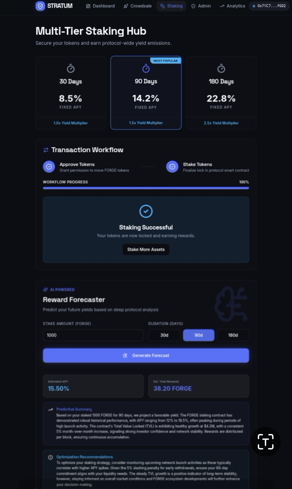

# Stratum Web3 — Enterprise Hybrid Liquidity & Staking Infrastructure

Stratum is a production-ready, full-stack Web3 launchpad and staking protocol that securely bridges on-chain financial primitives with low-latency off-chain data caching pipelines. The platform mitigates high network RPC costs by utilizing a resilient data aggregation engine to serve real-time metrics, predictive analytics, and transaction indexing.

## 🛠️ System Architecture

Stratum uses a split-tier hybrid architecture to ensure maximum performance and decentralized execution:

* **Tier 1: On-Chain Execution Engine (Solidity & EVM)**
  Immutable, gas-optimized smart contracts handle the core financial logic—including asset staking, reward distribution, and liquidity lockups. All state-changing operations are strictly bound by the Checks-Effects-Interactions pattern and custom reentrancy guards.
* **Tier 2: Off-Chain Aggregation & Presentation (Next.js & TypeScript)**
  To prevent RPC rate-limiting and ensure a sub-second UX, the frontend leverages server-side rendering (SSR) and aggressive background data caching. Read-state queries are batched and served via the Next.js pipeline rather than direct, synchronous blockchain polling.

## ✨ Key Features

<video src="stratum.mp4" controls width="640" height="360">
  Your browser does not support the video tag.
</video>

* **Advanced Staking Mechanics:** Dynamic APY calculations with secure, time-locked reward distributions.
* **RPC Request Batching:** Drastically reduces node provider costs by utilizing multicall aggregators and off-chain caching.
* **Enterprise-Grade Security:** Built-in safeguards against reentrancy, integer overflow/underflow, and flash-loan price manipulation.
* **Seamless Wallet Integration:** Native integration with Reown (AppKit) and Wagmi for a frictionless, multi-wallet onboarding experience.
* **Real-Time Analytics Dashboard:** Live tracking of Total Value Locked (TVL), user yields, and protocol health metrics.

## 💻 Tech Stack

**Frontend & Off-Chain Logic:**
* Next.js (App Router, Server Components)
* TypeScript
* Wagmi & Viem (EVM Hooks & Data Formatting)
* Reown AppKit (Wallet Connection)
* Tailwind CSS (UI/UX)

**Smart Contracts & Infrastructure:**
* Solidity
* Foundry (Forge, Anvil, Cast) for testing and deployment
* Local Anvil Node for rapid development

## 🚀 Quick Start (Local Development)

Follow these steps to spin up the entire full-stack environment locally.

### 1. Clone the Repository
```bash
git clone [https://github.com/Alfahdimiy/stratum-Web3.git](https://github.com/Alfahdimiy/stratum-Web3.git)
cd stratum-Web3
